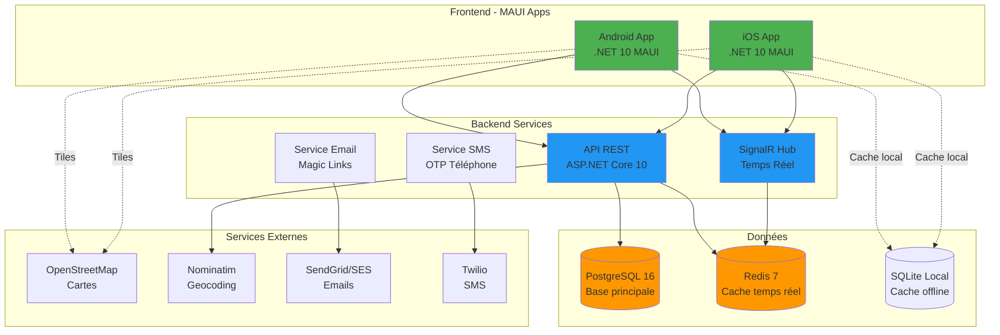
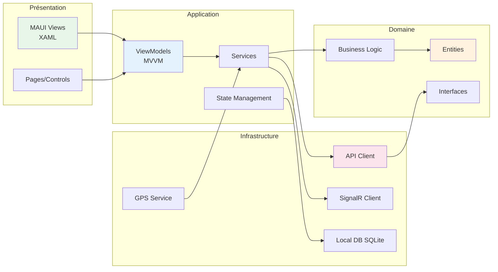
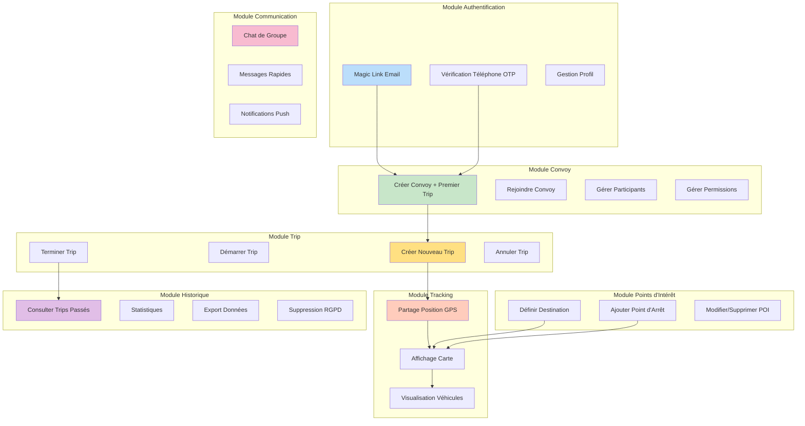
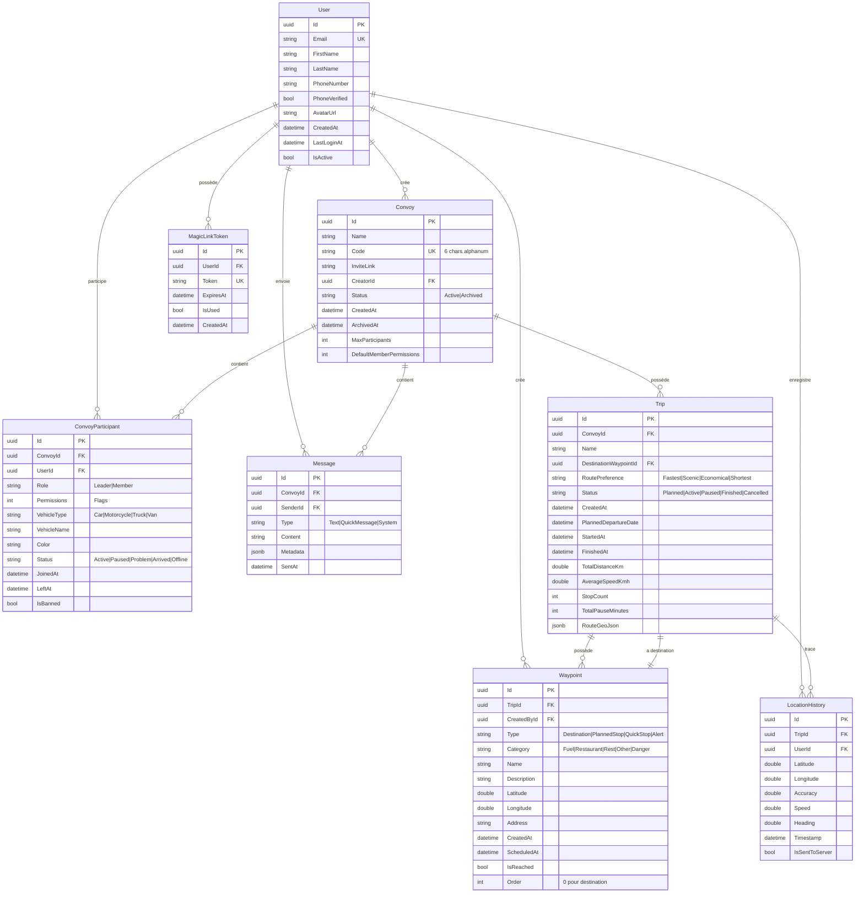
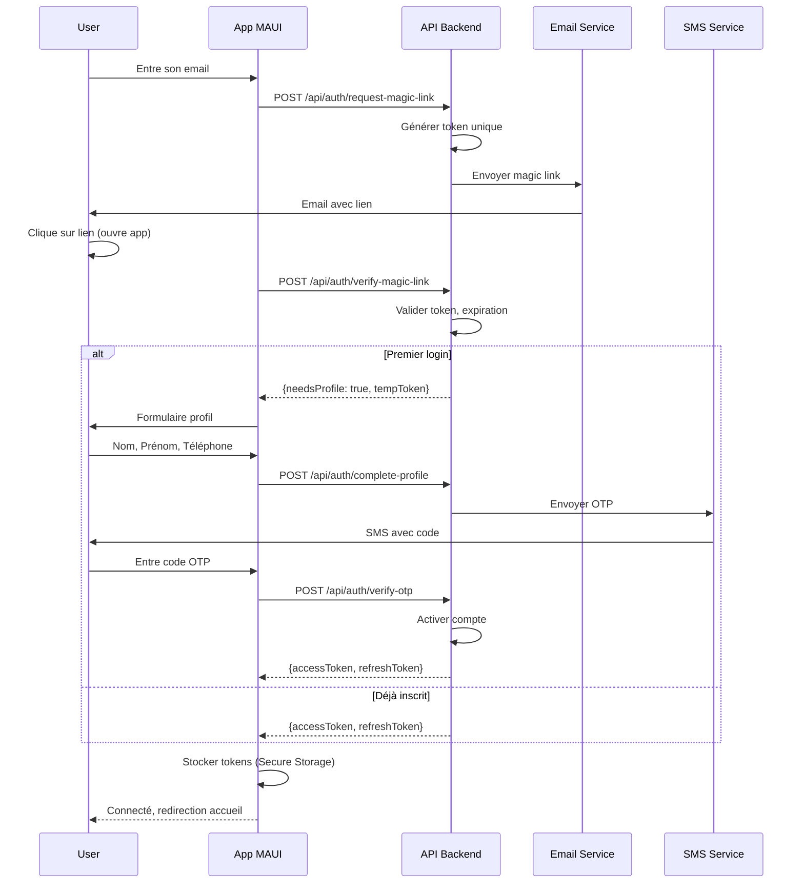
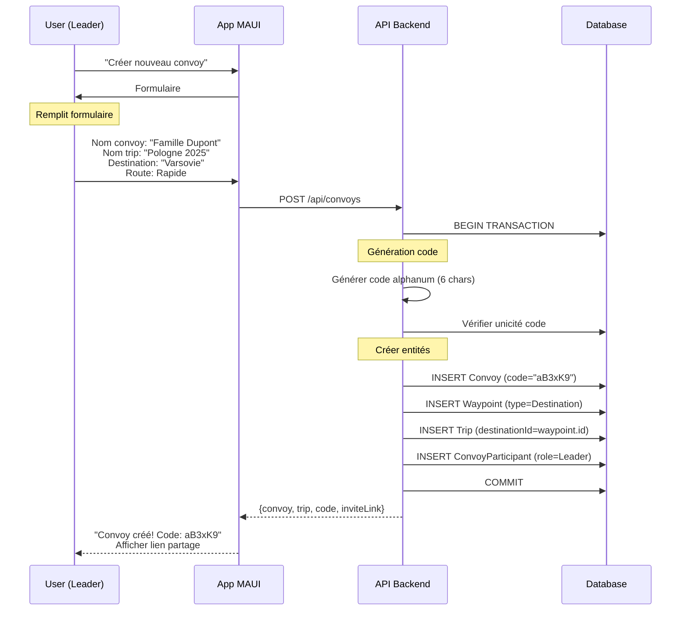
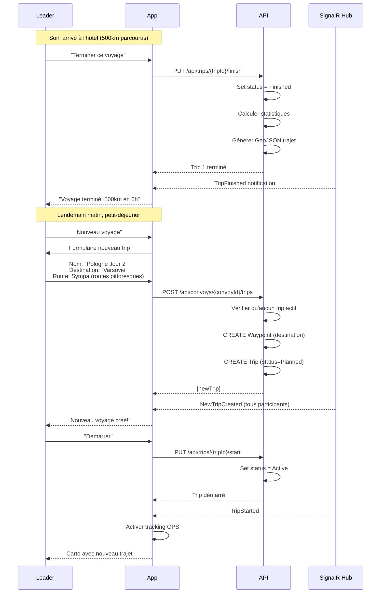
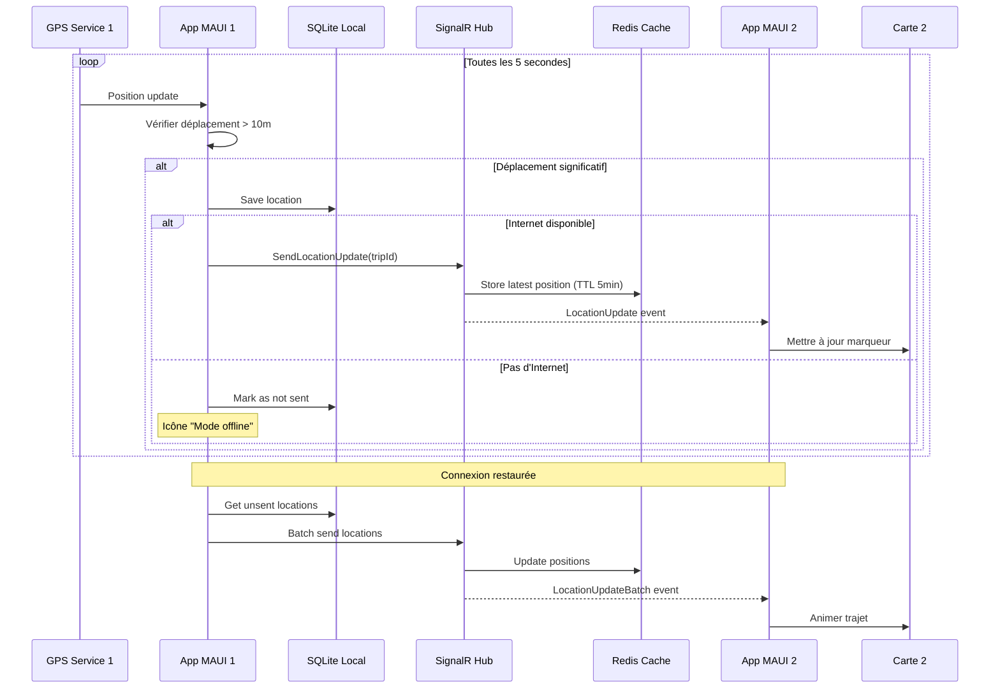
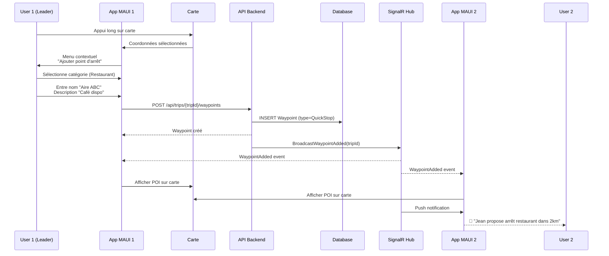
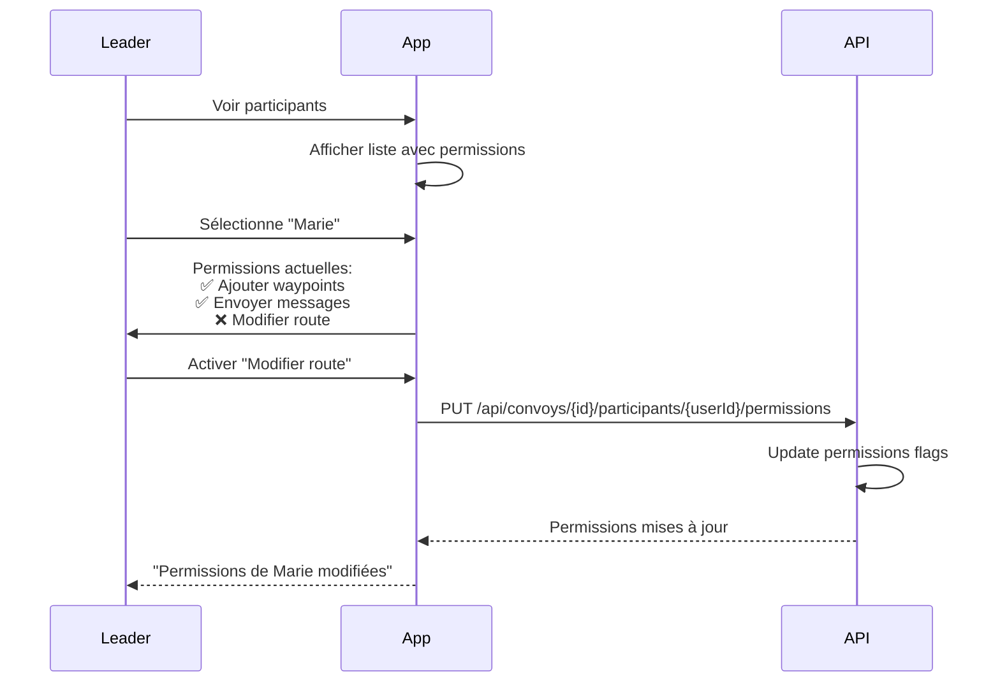

# SyncTrip - Documentation Technique et Fonctionnelle

## Table des matières

1. [Vue d'ensemble](#vue-densemble)
2. [Architecture Globale](#architecture-globale)
3. [Architecture Technique](#architecture-technique)
4. [Architecture Fonctionnelle](#architecture-fonctionnelle)
5. [Modèle de Données](#modèle-de-données)
6. [Flux et Cas d'Usage](#flux-et-cas-dusage)
7. [Sécurité et RGPD](#sécurité-et-rgpd)
8. [Technologies et Stack](#technologies-et-stack)
9. [Bonnes Pratiques](#bonnes-pratiques)
10. [Roadmap](#roadmap)

---

## Vue d'ensemble

### Concept

**SyncTrip** est une application mobile multiplateforme (Android/iOS) permettant à des groupes de voyageurs circulant dans différents véhicules de :
- Créer des groupes persistants (Convoys) avec des voyages multiples
- Se suivre en temps réel sur une carte
- Définir et partager des destinations et points d'arrêt
- Communiquer via chat de groupe
- Gérer des voyages multi-étapes (escales, voyages successifs)
- Conserver un historique détaillé des trajets

### Cas d'usage principaux

**Scénario 1 : Voyage familial simple**
- Famille se rendant en Pologne dans deux véhicules
- Crée un convoi "Famille Dupont - Pologne 2025"
- Un seul voyage : Paris → Varsovie
- Chacun navigue à son rythme en voyant les autres
- Ajout de points d'arrêt à la volée pour se retrouver

**Scénario 2 : Voyage avec escale**
- Même famille, trajet de 10h trop long
- Voyage 1 : Paris → Hôtel à mi-chemin (terminé le soir)
- Voyage 2 : Hôtel → Varsovie (démarré le lendemain)
- Même groupe, mêmes participants, deux voyages distincts

**Scénario 3 : Groupe réutilisable**
- Groupe d'amis motards "Potes Moto"
- Voyage 1 : Alpes (Été 2025) - Terminé
- Voyage 2 : Provence (Automne 2025) - Terminé
- Voyage 3 : Italie (Été 2026) - Planifié
- Même code de groupe, participants persistent

### Contraintes et Objectifs

- **Scalabilité** : De 2-3 véhicules (usage familial) à 10+ véhicules (groupes moto)
- **Flexibilité** : Groupes réutilisables, voyages multi-étapes
- **Connectivité** : Nécessite Internet mais avec cache offline robuste
- **Conformité** : Respect du RGPD avec données supprimables
- **Sécurité** : Authentification passwordless, données chiffrées
- **Code quality** : Architecture modulaire, maintenable, testable

---

## Architecture Globale

### Diagramme d'Architecture Système



### Architecture N-Tiers



### Architecture Client-Serveur (pas de P2P)

**Choix architectural** : Serveur central plutôt que peer-to-peer

**Raisons** :
- Fiabilité : Synchronisation garantie même avec connexions intermittentes
- Simplicité : Pas de gestion de mesh network complexe
- Scalabilité : Supporte 10+ véhicules facilement
- Historique : Stockage centralisé des trajets
- Sécurité : Contrôle d'accès centralisé

---

## Architecture Technique

### Stack Technique Frontend (.NET MAUI)

#### Frameworks et Librairies

| Composant | Technologie | Version | Usage |
|-----------|-------------|---------|-------|
| **Framework** | .NET MAUI | 10.0 | Application multiplateforme |
| **Pattern** | MVVM | - | Séparation UI/Logique |
| **MVVM Toolkit** | CommunityToolkit.Mvvm | 8.x | Simplification MVVM |
| **Navigation** | Shell Navigation | Built-in | Navigation déclarative |
| **Cartes** | Mapsui | 5.x | Affichage cartes OpenStreetMap |
| **GPS** | Microsoft.Maui.Devices.Sensors | Built-in | Géolocalisation |
| **HTTP Client** | System.Net.Http | Built-in | API REST |
| **SignalR Client** | Microsoft.AspNetCore.SignalR.Client | 10.x | WebSocket temps réel |
| **Base locale** | SQLite-net-pcl | 1.9.x | Cache et offline |
| **Sérialisation** | System.Text.Json | Built-in | JSON |
| **DI Container** | Microsoft.Extensions.DependencyInjection | Built-in | Injection de dépendances |
| **Logging** | Microsoft.Extensions.Logging | Built-in | Logs structurés |

#### Structure du Projet Frontend

```
SyncTrip/
├── Platforms/              # Code spécifique par plateforme
│   ├── Android/
│   ├── iOS/
│   ├── Windows/
│   └── MacCatalyst/
├── Core/                   # Couche domaine
│   ├── Entities/          # Entités métier
│   │   ├── Convoy.cs
│   │   ├── Trip.cs
│   │   ├── ConvoyParticipant.cs
│   │   ├── Waypoint.cs
│   │   └── User.cs
│   ├── Enums/             # Énumérations
│   │   ├── ConvoyStatus.cs
│   │   ├── TripStatus.cs
│   │   ├── ParticipantRole.cs
│   │   ├── ParticipantPermissions.cs
│   │   └── WaypointType.cs
│   ├── Interfaces/        # Contrats de services
│   └── Constants/         # Constantes
├── Services/              # Couche infrastructure
│   ├── Api/               # Client API REST
│   ├── SignalR/           # Client SignalR
│   ├── Location/          # Service GPS
│   ├── Database/          # SQLite local
│   ├── Authentication/    # Gestion auth JWT
│   ├── Cache/             # Gestion cache
│   └── CodeGenerator/     # Génération codes convoi
├── ViewModels/            # ViewModels MVVM
│   ├── Base/              # BaseViewModel
│   ├── Auth/              # MagicLink, Verification
│   ├── Convoy/            # Gestion convois et trips
│   ├── Map/               # Carte et tracking
│   └── History/           # Historique
├── Views/                 # Pages XAML
│   ├── Auth/
│   ├── Convoy/
│   ├── Trip/
│   ├── Map/
│   └── History/
├── Controls/              # Composants réutilisables
├── Converters/            # Value Converters XAML
├── Behaviors/             # Behaviors XAML
├── Models/                # DTOs et ViewModels
│   ├── DTOs/              # Data Transfer Objects
│   ├── Requests/          # Requêtes API
│   └── Responses/         # Réponses API
├── Resources/             # Ressources
│   ├── Styles/            # Styles XAML
│   ├── Images/            # Images
│   └── Fonts/             # Polices
├── Helpers/               # Utilitaires
└── App.xaml               # Point d'entrée
```

### Stack Technique Backend (ASP.NET Core)

#### Frameworks et Librairies

| Composant | Technologie | Version | Usage |
|-----------|-------------|---------|-------|
| **Framework** | ASP.NET Core | 10.0 | API Web |
| **ORM** | Entity Framework Core | 10.x | Accès données |
| **Base de données** | PostgreSQL | 16.x | Stockage principal |
| **Cache** | Redis | 7.x | Cache distribué, positions temps réel |
| **Temps réel** | SignalR | 10.x | Communication bidirectionnelle |
| **Authentication** | JWT Bearer | 10.x | Authentification stateless |
| **Validation** | FluentValidation | 11.x | Validation des requêtes |
| **Mapping** | AutoMapper | 13.x | Mapping DTOs/Entities |
| **API Docs** | Swagger/OpenAPI | 6.x | Documentation API |
| **Logging** | Serilog | 4.x | Logs structurés |
| **Tests** | xUnit + Moq | - | Tests unitaires |
| **Email** | SendGrid / AWS SES | - | Magic links |
| **SMS** | Twilio | - | OTP téléphone |

#### Structure du Projet Backend

```
SyncTrip.Api/
├── Controllers/           # Contrôleurs API REST
│   ├── AuthController.cs
│   ├── ConvoysController.cs
│   ├── TripsController.cs
│   ├── WaypointsController.cs
│   ├── UsersController.cs
│   └── HistoryController.cs
├── Hubs/                  # SignalR Hubs
│   └── ConvoyHub.cs       # Hub temps réel
├── Core/                  # Couche domaine
│   ├── Entities/          # Entités EF Core
│   │   ├── Convoy.cs
│   │   ├── Trip.cs
│   │   ├── ConvoyParticipant.cs
│   │   ├── Waypoint.cs
│   │   ├── LocationHistory.cs
│   │   ├── User.cs
│   │   └── MagicLinkToken.cs
│   ├── Enums/
│   ├── Interfaces/        # Repository pattern
│   └── Specifications/    # Spec pattern
├── Application/           # Couche application
│   ├── Services/          # Services métier
│   │   ├── ConvoyService.cs
│   │   ├── TripService.cs
│   │   ├── AuthService.cs
│   │   ├── EmailService.cs
│   │   └── SmsService.cs
│   ├── DTOs/              # Data Transfer Objects
│   ├── Validators/        # FluentValidation
│   └── Mappings/          # AutoMapper profiles
├── Infrastructure/        # Couche infrastructure
│   ├── Data/              # DbContext, Repositories
│   ├── Cache/             # Redis service
│   ├── External/          # Services externes (Geocoding)
│   └── CodeGenerator/     # Génération codes convoi
├── Middleware/            # Middlewares custom
│   ├── ErrorHandlingMiddleware.cs
│   └── RequestLoggingMiddleware.cs
├── Configuration/         # Extensions et config
└── Program.cs             # Point d'entrée
```

---

## Architecture Fonctionnelle

### Concepts Clés

**Convoy (Groupe persistant)**
- Groupe de personnes qui voyagent ensemble
- Code permanent alphanumérique (6 caractères)
- Peut contenir plusieurs voyages (trips)
- Les participants persistent entre les voyages

**Trip (Instance de voyage)**
- Un trajet spécifique avec une destination obligatoire
- Lié à un convoy
- Un seul trip actif par convoy à la fois
- Contient les waypoints et l'historique de positions

**Waypoint (Point d'intérêt)**
- Destination (obligatoire pour chaque trip)
- Points d'arrêt planifiés ou à la volée
- Alertes routières

### Modules Fonctionnels



### Fonctionnalités Détaillées

#### 1. Authentification Passwordless

**Magic Link Email**
- Utilisateur entre son email
- Backend envoie un lien unique avec token
- Utilisateur clique sur le lien (ouvre l'app)
- Token validé → JWT access token généré
- Expiration : 15 minutes

**Vérification Téléphone (2FA au premier login)**
- Après magic link validé
- Utilisateur entre son numéro de téléphone
- Code OTP envoyé par SMS
- Validation du code → profil activé

**Profil**
- Nom, prénom, photo
- Email (vérifié)
- Téléphone (optionnel mais recommandé)
- Suppression de compte

#### 2. Gestion des Convoys

**Création de Convoy**
- Nom du convoy (ex: "Famille Dupont")
- Génération automatique d'un code alphanumérique (6 caractères : A-Z, a-z, 0-9)
  - 62^6 = 56,8 milliards de possibilités
- Génération d'un lien d'invitation
- **Création automatique du premier trip** avec destination obligatoire
- Le créateur devient "Leader" du convoy

**Rejoindre un Convoy**
- Via code PIN alphanumérique (ex: "aB3xK9")
- Via lien d'invitation
- Rejoint automatiquement le trip actif

**Participants**
- Liste des participants avec statuts
- Rôles : Leader, Member
- Permissions configurables par participant
- Exclusion (kick) ou ban d'un participant (leader uniquement)
- Promotion/rétrogradation de rôle

**États du Convoy**
- Active : convoy actif, peut créer des trips
- Archived : convoy archivé (read-only)
- Auto-archivage si aucun participant pendant 30 jours

**Nettoyage automatique**
- Convoys sans participants depuis 30 jours : archivés
- Convoys archivés depuis 1 an : supprimés (libère les codes)

#### 3. Gestion des Trips (Voyages)

**Création de Trip**
- **Premier trip** : créé automatiquement lors de la création du convoy
- **Trips suivants** : créés manuellement par le leader dans un convoy existant
- Nom du trip (ex: "Pologne Jour 2")
- **Destination obligatoire** (recherche d'adresse ou sélection sur carte)
- Préférence de route :
  - Rapide (autoroutes)
  - Sympa (routes pittoresques)
  - Économique (éviter péages)
  - Courte (distance minimale)
- Date de départ prévue (optionnel)

**Contrainte importante** : Un seul trip actif par convoy à la fois

**États du Trip**
- Planned : pas encore démarré
- Active : en cours (tracking GPS actif)
- Paused : en pause (escale hôtel par exemple)
- Finished : terminé avec succès
- Cancelled : annulé

**Opérations**
- Démarrer un trip : passage de Planned → Active
- Mettre en pause : Active → Paused (tracking continue mais marqué en pause)
- Reprendre : Paused → Active
- Terminer : Active → Finished (calcul statistiques automatique)
- Annuler : Any → Cancelled

#### 4. Tracking GPS et Carte

**Suivi en Temps Réel**
- Position GPS mise à jour toutes les 5-10 secondes (configurable)
- Optimisation : envoi uniquement si déplacement > 10 mètres
- Affichage de tous les véhicules du trip actif
- Affichage de la direction et vitesse
- Calcul automatique de la distance entre véhicules
- ETA (Estimated Time of Arrival) pour chaque véhicule

**Carte Interactive**
- Basée sur OpenStreetMap (Mapsui)
- Centrage automatique sur le groupe
- Zoom et déplacement manuel
- Marqueurs personnalisables par véhicule (couleur, icône)
- Trajet effectué (polyligne)
- Distance restante jusqu'à destination

**Mode Offline**
- Cache des tuiles de carte
- Dernières positions connues affichées
- Positions enregistrées localement (SQLite)
- Synchronisation automatique au retour de la connexion

#### 5. Points d'Intérêt (POI)

**Types de Waypoints**
- **Destination** : 1 obligatoire par trip (ne peut pas être supprimée)
- **PlannedStop** : arrêts planifiés à l'avance
- **QuickStop** : arrêts ajoutés à la volée pendant le trajet
- **Alert** : alertes (danger, travaux, etc.)

**Création de Waypoint**
- Recherche par adresse (geocoding Nominatim)
- Sélection sur la carte (appui long)
- Position actuelle du véhicule
- Catégories : Essence, Restauration, Repos, Autre, Danger

**Gestion Waypoints**
- Modification (créateur ou leader, selon permissions)
- Suppression (sauf destination)
- Marquer comme "atteint"
- Notification push à tous les participants
- Ordre des waypoints

**Permissions**
- Par défaut : tous les membres peuvent ajouter des waypoints
- Configurable par le leader (peut restreindre)

#### 6. Communication

**Chat de Groupe**
- Une seule discussion par convoy (visible dans tous les trips)
- Messages texte simples
- Historique limité (derniers 100 messages ou 7 jours)
- Pas de messages privés (utiliser WhatsApp/SMS pour ça)

**Messages Rapides Prédéfinis**
- "Je fais une pause"
- "J'ai un problème technique"
- "Je dois faire le plein"
- "Je suis arrivé"
- "Ralentissez, je suis loin"
- Boutons rapides dans l'interface

**Notifications Push**
- Nouveau participant dans le convoy
- Nouveau trip créé
- Nouveau waypoint ajouté
- Modification de destination (leader uniquement)
- Message du leader (marqué spécial)
- Participant arrivé à destination
- SOS / Problème technique

**Statuts Véhicule**
- En route (vert)
- En pause (orange)
- Problème technique (rouge)
- Arrivé (bleu)
- Hors ligne (gris)

#### 7. Permissions et Rôles

**Rôles**
- **Leader** : tous les droits sur le convoy et les trips
- **Member** : permissions configurables

**Permissions (flags combinables)**
- `CanAddWaypoints` : peut ajouter des points d'arrêt
- `CanSendMessages` : peut envoyer des messages au chat
- `CanModifyRoute` : peut suggérer modifications de route
- `CanSeeAllPositions` : peut voir positions de tous (sinon juste les leaders)

**Permissions par défaut** pour un nouveau membre :
- ✅ Ajouter waypoints
- ✅ Envoyer messages
- ✅ Voir toutes les positions
- ❌ Modifier route

**Actions du Leader**
- Promouvoir un membre en Leader (co-leader)
- Rétrograder un leader en membre
- Modifier permissions individuelles
- Kick (retirer du convoy)
- Ban (bloquer définitivement)
- Modifier destination du trip actif
- Créer/terminer des trips

#### 8. Historique et Statistiques

**Trips Passés**
- Liste de tous les trips d'un convoy
- Filtres : Terminés, Annulés, Tous
- Détails : date, participants, trajet, durée
- Visualisation du trajet sur carte (GeoJSON)
- Points d'arrêt effectués

**Statistiques par Trip**
- Distance totale parcourue (km)
- Temps de trajet (HH:MM)
- Vitesse moyenne (km/h)
- Nombre d'arrêts
- Temps de pause total
- Durée effective de conduite

**Statistiques Agrégées (Convoy)**
- Nombre total de trips
- Distance totale tous trips confondus
- Temps total de voyage
- Nombre de participants différents
- Carte de chaleur des zones visitées

**Export et RGPD**
- Export complet des données personnelles (JSON)
- Export d'un trip spécifique (GPX, KML, JSON)
- Suppression de trips spécifiques
- Suppression complète du compte
- Conservation configurable (30, 90, 365 jours, illimité)

---

## Modèle de Données

### Diagramme Entité-Relation



### Schémas JSON

#### DTO: CreateConvoyRequest

```json
{
  "convoyName": "Famille Dupont",
  "firstTripName": "Pologne 2025",
  "destinationName": "Varsovie, Pologne",
  "destinationLatitude": 52.2297,
  "destinationLongitude": 21.0122,
  "routePreference": "Fastest",
  "plannedDepartureDate": "2025-11-20T08:00:00Z",
  "maxParticipants": 10
}
```

#### DTO: ConvoyDetailResponse

```json
{
  "id": "uuid",
  "name": "Famille Dupont",
  "code": "aB3xK9",
  "inviteLink": "https://synctrip.app/join/xyz789",
  "status": "Active",
  "createdAt": "2025-01-15T08:00:00Z",
  "creator": {
    "id": "uuid",
    "firstName": "Jean",
    "lastName": "Dupont",
    "avatarUrl": "https://..."
  },
  "participants": [
    {
      "id": "uuid",
      "userId": "uuid",
      "firstName": "Jean",
      "lastName": "Dupont",
      "role": "Leader",
      "permissions": ["CanAddWaypoints", "CanSendMessages", "CanModifyRoute", "CanSeeAllPositions"],
      "vehicleType": "Car",
      "vehicleName": "Peugeot 3008",
      "color": "#FF5722",
      "status": "Active",
      "currentLocation": {
        "latitude": 48.8566,
        "longitude": 2.3522,
        "speed": 110.5,
        "heading": 45.2,
        "timestamp": "2025-01-15T10:30:00Z"
      }
    }
  ],
  "activeTrip": {
    "id": "uuid",
    "name": "Pologne 2025",
    "status": "Active",
    "routePreference": "Fastest",
    "destination": {
      "id": "uuid",
      "name": "Varsovie, Pologne",
      "latitude": 52.2297,
      "longitude": 21.0122,
      "address": "Warsaw, Poland"
    },
    "waypoints": [
      {
        "id": "uuid",
        "type": "QuickStop",
        "category": "Restaurant",
        "name": "Aire de Service ABC",
        "latitude": 49.1234,
        "longitude": 3.5678,
        "order": 1,
        "isReached": false
      }
    ],
    "statistics": {
      "totalDistance": 245.8,
      "averageSpeed": 105.3,
      "elapsedTime": 3600
    }
  },
  "pastTrips": [
    {
      "id": "uuid",
      "name": "Alpes 2024",
      "status": "Finished",
      "finishedAt": "2024-08-15T18:00:00Z"
    }
  ]
}
```

#### SignalR Message: LocationUpdate

```json
{
  "type": "LocationUpdate",
  "tripId": "uuid",
  "userId": "uuid",
  "location": {
    "latitude": 48.8566,
    "longitude": 2.3522,
    "accuracy": 10.5,
    "speed": 110.5,
    "heading": 45.2,
    "timestamp": "2025-01-15T10:30:00Z"
  }
}
```

#### SignalR Message: WaypointAdded

```json
{
  "type": "WaypointAdded",
  "tripId": "uuid",
  "waypoint": {
    "id": "uuid",
    "type": "QuickStop",
    "category": "Restaurant",
    "name": "Aire de Service ABC",
    "latitude": 49.1234,
    "longitude": 3.5678,
    "createdBy": {
      "id": "uuid",
      "firstName": "Jean"
    },
    "createdAt": "2025-01-15T10:25:00Z"
  }
}
```

---

## Flux et Cas d'Usage

### Cas d'Usage 1 : Authentification Passwordless



### Cas d'Usage 2 : Créer Convoy et Premier Trip



### Cas d'Usage 3 : Voyage avec Escale (Multi-Trip)



### Cas d'Usage 4 : Suivi GPS en Temps Réel



### Cas d'Usage 5 : Ajouter Point d'Arrêt à la Volée



### Cas d'Usage 6 : Gestion Permissions



---

## Sécurité et RGPD

### Authentification Passwordless

#### Magic Link Flow

**Avantages**
- Pas de mot de passe à retenir/oublier
- Pas de hash à stocker
- Plus sécurisé (token à usage unique)
- UX moderne et simple

**Implémentation**

```csharp
public class MagicLinkToken
{
    public Guid Id { get; set; }
    public Guid UserId { get; set; }

    [Required]
    public string Token { get; set; } // GUID ou random string

    public DateTime ExpiresAt { get; set; } // 15 minutes
    public bool IsUsed { get; set; }
    public DateTime CreatedAt { get; set; }

    public User User { get; set; }
}
```

**Sécurité**
- Token : GUID aléatoire cryptographiquement sûr
- Expiration : 15 minutes
- Usage unique (marqué `IsUsed` après validation)
- Rate limiting : max 3 demandes par email par heure
- HTTPS obligatoire

#### 2FA Téléphone (optionnel mais recommandé)

**Flow**
1. Premier login : magic link validé
2. Demande numéro de téléphone
3. Envoi OTP (6 chiffres) par SMS
4. Validation OTP → profil activé

**Après activation**
- 2FA optionnelle (paramètres)
- Réactivation possible à tout moment

### JWT Tokens

**Structure**

```json
// Access Token (durée: 1 heure)
{
  "sub": "user-id",
  "email": "user@example.com",
  "name": "Jean Dupont",
  "exp": 1705324800,
  "iat": 1705323900
}

// Refresh Token (durée: 30 jours)
{
  "sub": "user-id",
  "type": "refresh",
  "exp": 1707916800
}
```

**Stockage**
- Frontend : Secure Storage MAUI (chiffré)
- Backend : Redis avec TTL

### Protection des Données (RGPD)

#### Principes Appliqués

1. **Minimisation des données**
   - Email, nom, prénom, téléphone (optionnel)
   - Position GPS uniquement durant trips actifs
   - Historique limité dans le temps

2. **Droit à l'oubli**
   - Suppression de compte
   - Suppression de trips spécifiques
   - Anonymisation des données après suppression
   - Export complet avant suppression

3. **Portabilité**
   - Export JSON complet
   - Export GPX/KML par trip
   - API standardisée

4. **Consentement**
   - Acceptation CGU explicite
   - Opt-in notifications
   - Opt-in conservation historique

5. **Sécurité**
   - HTTPS/TLS obligatoire
   - Tokens sécurisés (JWT)
   - Chiffrement données sensibles
   - Rate limiting

#### Données Collectées

| Donnée | Finalité | Durée Conservation | Supprimable |
|--------|----------|-------------------|-------------|
| Email | Identification, magic links | Tant que compte actif | Oui |
| Nom, prénom | Affichage profil | Tant que compte actif | Oui |
| Téléphone | 2FA, notifications | Tant que compte actif | Oui |
| Position GPS temps réel | Suivi convoy | Durée du trip | Auto-supprimé |
| Historique positions | Statistiques, replay | Configurable (30-365j) | Oui |
| Messages chat | Communication | 7 jours ou fin trip | Auto-supprimé |
| Statistiques trips | Historique | Configurable | Oui |

#### API RGPD

```http
# Export complet des données
GET /api/users/me/export
Response: JSON avec toutes les données

# Suppression d'un trip
DELETE /api/trips/{tripId}

# Suppression du compte
DELETE /api/users/me
```

### Sécurité Technique

#### Backend

- **Validation** : FluentValidation sur toutes les requêtes
- **Rate limiting** : 100 req/min par IP, 50 req/min par user
- **CORS** : Origines autorisées configurées
- **Headers** : HSTS, X-Content-Type-Options, X-Frame-Options
- **Secrets** : Variables d'environnement, Azure Key Vault
- **Logs** : Pas de données sensibles (email/position masqués)

#### Frontend

- **Secure Storage** : Chiffrement natif (iOS Keychain, Android Keystore)
- **Certificate Pinning** : Validation certificat serveur
- **Code Obfuscation** : Dotfuscator en production
- **Validation client** : Pré-validation avant envoi API

---

## Technologies et Stack

### Décisions Architecturales

#### Pourquoi .NET 10 MAUI ?

**Avantages**
- Multiplateforme : un code pour Android/iOS/Windows
- Performance native (compilation AOT)
- Accès direct aux APIs plateforme
- Écosystème .NET riche
- Hot Reload ultra rapide
- Support Microsoft long terme

#### Pourquoi OpenStreetMap (Mapsui) ?

**Avantages**
- **Gratuit** et open source
- **Pas de limites** d'utilisation
- Données mondiales complètes
- Personnalisable à 100%
- Pas de dépendance Google/Apple
- Tiles cachables en offline

**Alternatives considérées**
- Google Maps : Payant, quotas, vendor lock-in
- Apple Maps : iOS uniquement
- Mapbox : Payant après quota

#### Pourquoi PostgreSQL ?

**Avantages**
- Open source et gratuit
- Support JSON/JSONB natif
- PostGIS pour données géospatiales
- Performance éprouvée
- Transactions ACID
- Scaling vertical et horizontal

#### Pourquoi SignalR ?

**Avantages**
- Intégration native .NET 10
- Gestion auto reconnexions
- Fallback (WebSocket → SSE → Long Polling)
- Groupes pour trips
- Typage fort C#
- Scale-out avec Redis backplane

#### Pourquoi Redis ?

**Avantages**
- Ultra rapide (in-memory)
- Expiration auto (TTL)
- Pub/Sub pour SignalR
- Structures de données riches
- Scaling horizontal

**Usage**
- Positions GPS récentes (TTL 5min)
- Cache queries fréquentes
- Rate limiting
- SignalR backplane (scale-out)

### Configuration Environnements

#### Développement

```yaml
Frontend:
  - .NET 10 SDK
  - Émulateur Android 14+
  - Simulateur iOS 17+
  - API locale : https://localhost:7001

Backend:
  - .NET 10 SDK
  - PostgreSQL 16 (Docker)
  - Redis 7 (Docker)
  - API ASP.NET Core 10

Outils:
  - Visual Studio 2022 17.12+ / Rider 2024.3+
  - Docker Desktop
  - Postman / Insomnia
  - pgAdmin 4
```

#### Production

```yaml
Frontend:
  - Build Release AOT
  - Obfuscation activée
  - API : https://api.synctrip.app

Backend:
  - Azure App Service / AWS ECS
  - PostgreSQL managed
  - Redis managed
  - HTTPS + HSTS
  - Rate limiting actif
  - Monitoring Application Insights

CI/CD:
  - GitHub Actions
  - Tests auto (>80% coverage)
  - Déploiement automatique
```

---

## Bonnes Pratiques

### Génération Code Convoy

```csharp
public class ConvoyCodeGenerator
{
    private const string CHARS = "ABCDEFGHIJKLMNOPQRSTUVWXYZabcdefghijklmnopqrstuvwxyz0123456789";
    private const int CODE_LENGTH = 6;

    public static string GenerateCode()
    {
        var random = new Random();
        return new string(Enumerable.Range(0, CODE_LENGTH)
            .Select(_ => CHARS[random.Next(CHARS.Length)])
            .ToArray());
    }

    // Vérification unicité
    public async Task<string> GenerateUniqueCodeAsync()
    {
        string code;
        do
        {
            code = GenerateCode();
        } while (await _context.Convoys.AnyAsync(c => c.Code == code));

        return code;
    }
}

// Exemples de codes générés : aB3xK9, Zp7mQ2, kL9nR4
// Probabilité collision : 1 / 56,800,235,584 ≈ 0.0000000176%
```

### Architecture MVVM

```csharp
public partial class ConvoyMapViewModel : BaseViewModel
{
    private readonly IConvoyService _convoyService;
    private readonly ILocationService _locationService;
    private readonly ISignalRService _signalRService;

    [ObservableProperty]
    private Convoy _currentConvoy;

    [ObservableProperty]
    private Trip _activeTrip;

    [ObservableProperty]
    private ObservableCollection<ParticipantPin> _participantPins;

    [RelayCommand]
    private async Task StartTrackingAsync()
    {
        if (ActiveTrip?.Status != TripStatus.Active) return;

        await _locationService.StartTrackingAsync(async (location) =>
        {
            await _signalRService.SendLocationUpdateAsync(new LocationUpdateDto
            {
                TripId = ActiveTrip.Id,
                Latitude = location.Latitude,
                Longitude = location.Longitude,
                Speed = location.Speed ?? 0,
                Heading = location.Course ?? 0
            });
        });
    }
}
```

### Repository Pattern

```csharp
public interface IConvoyRepository : IRepository<Convoy>
{
    Task<Convoy> GetByCodeAsync(string code);
    Task<Convoy> GetWithActiveTrip Async(Guid convoyId);
    Task<IEnumerable<Convoy>> GetUserConvoysAsync(Guid userId, bool includeArchived = false);
}

public class ConvoyRepository : Repository<Convoy>, IConvoyRepository
{
    public async Task<Convoy> GetWithActiveTripAsync(Guid convoyId)
    {
        return await _context.Convoys
            .Include(c => c.Participants).ThenInclude(p => p.User)
            .Include(c => c.Trips.Where(t => t.Status == TripStatus.Active))
                .ThenInclude(t => t.Waypoints)
            .FirstOrDefaultAsync(c => c.Id == convoyId);
    }
}
```

### Nettoyage Automatique (Background Service)

```csharp
public class ConvoyCleanupService : BackgroundService
{
    protected override async Task ExecuteAsync(CancellationToken stoppingToken)
    {
        while (!stoppingToken.IsCancellationRequested)
        {
            // Archiver convoys sans participants depuis 30 jours
            var emptyConvoys = await _context.Convoys
                .Where(c => c.Status == ConvoyStatus.Active)
                .Where(c => !c.Participants.Any())
                .Where(c => c.CreatedAt < DateTime.UtcNow.AddDays(-30))
                .ToListAsync();

            foreach (var convoy in emptyConvoys)
            {
                convoy.Status = ConvoyStatus.Archived;
                convoy.ArchivedAt = DateTime.UtcNow;
            }

            // Supprimer convoys archivés depuis 1 an
            var oldArchivedConvoys = await _context.Convoys
                .Where(c => c.Status == ConvoyStatus.Archived)
                .Where(c => c.ArchivedAt < DateTime.UtcNow.AddYears(-1))
                .ToListAsync();

            _context.Convoys.RemoveRange(oldArchivedConvoys);

            await _context.SaveChangesAsync();

            // Exécuter toutes les 24h
            await Task.Delay(TimeSpan.FromDays(1), stoppingToken);
        }
    }
}
```

---

## Roadmap

### Phase 1 : MVP (3-4 mois)

**Objectifs**
- Application fonctionnelle pour cas de base
- 2-5 véhicules
- Fonctionnalités essentielles

**Features**
- ✅ Authentification magic link + 2FA téléphone
- ✅ Création convoy avec premier trip
- ✅ Rejoindre convoy (code/lien)
- ✅ Suivi GPS temps réel
- ✅ Carte OpenStreetMap avec participants
- ✅ Ajout destination obligatoire
- ✅ Ajout points d'arrêt
- ✅ Chat de groupe basique
- ✅ Notifications push
- ✅ Mode offline (cache local)
- ✅ Terminer trip et créer nouveau trip

**Technique**
- Backend ASP.NET Core 10
- Frontend MAUI .NET 10 (Android + iOS)
- PostgreSQL + Redis
- SignalR temps réel
- CI/CD basique

### Phase 2 : Amélioration (2-3 mois)

**Objectifs**
- Scalabilité 10+ véhicules
- UX améliorée
- Permissions avancées

**Features**
- ✅ Système permissions granulaires
- ✅ Gestion rôles (Leader/Member)
- ✅ Messages rapides prédéfinis
- ✅ Statuts véhicule
- ✅ ETA et distances calculées
- ✅ Historique complet avec statistiques
- ✅ Export GPX/KML
- ✅ Mode pause trip
- ✅ Réutilisation groupes

**Technique**
- Optimisation GPS (batching)
- Tests E2E
- Monitoring avancé
- Performance tuning

### Phase 3 : Avancé (3-4 mois)

**Objectifs**
- Différenciation produit
- Engagement utilisateur

**Features**
- ✅ Partage photos aux waypoints
- ✅ Alertes routières collaboratives
- ✅ Intégration météo
- ✅ Suggestions POI automatiques (IA)
- ✅ Modes convoy (Route, Moto, 4x4)
- ✅ Planification trajet multi-étapes
- ✅ Replay animé des trajets
- ✅ Statistiques agrégées convoy

**Technique**
- ML.NET pour suggestions
- APIs tierces (météo, traffic)
- Version Windows app

### Phase 4 : Enterprise (6+ mois)

**Objectifs**
- Grands groupes et flottes
- Monétisation

**Features**
- ✅ Support 50+ véhicules
- ✅ Gestion de flotte professionnelle
- ✅ Rapports personnalisés
- ✅ API publique
- ✅ White-label
- ✅ SLA et support premium

**Technique**
- Kubernetes
- Multi-région
- CDN cartes
- Analytics avancés

---

## Annexes

### Glossaire

| Terme | Définition |
|-------|------------|
| **Convoy** | Groupe persistant de personnes avec code permanent |
| **Trip** | Instance de voyage avec destination obligatoire |
| **Leader** | Créateur/administrateur d'un convoy |
| **Participant** | Membre d'un convoy |
| **Waypoint** | Point d'intérêt (destination, arrêt, alerte) |
| **Magic Link** | Lien unique d'authentification sans mot de passe |
| **2FA** | Two-Factor Authentication (téléphone) |
| **OTP** | One-Time Password (code à usage unique) |

### Ressources

- [.NET MAUI Docs](https://learn.microsoft.com/dotnet/maui/)
- [ASP.NET Core](https://learn.microsoft.com/aspnet/core/)
- [SignalR](https://learn.microsoft.com/aspnet/core/signalr/)
- [Mapsui](https://mapsui.com/)
- [OpenStreetMap](https://www.openstreetmap.org/)

---

**Version** : 2.0
**Date** : 2025-11-16
**Statut** : Spécifications validées
